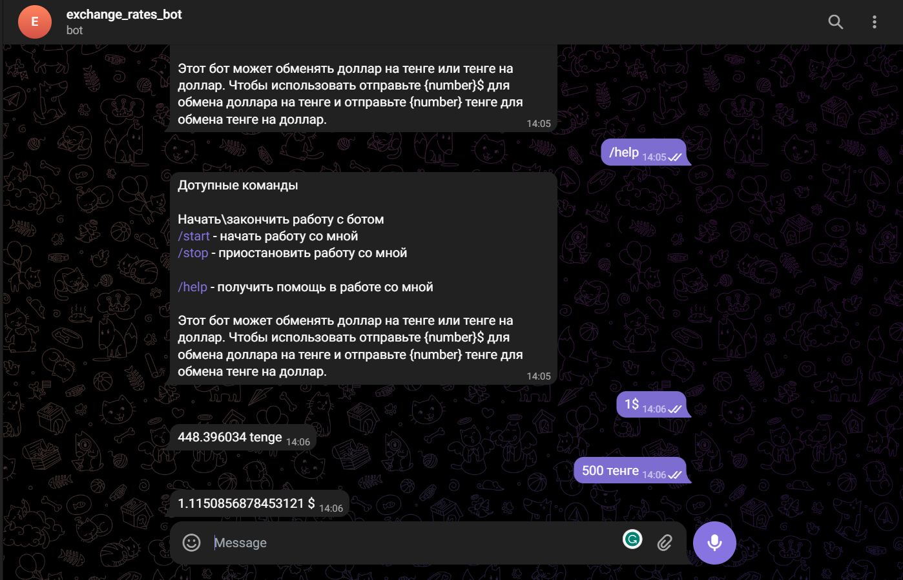

# Exchange Rate Telegram Bot
This bot can exchange dollar to tenge or tenge to dollor. To use send {number}$ for exchange dollar to tenge, and send {number} тенге to exchange tenge to dollar.

This project provides a microservice developed with Spring Boot that interacts with the Telegram Bot API. The bot is designed to provide currency exchange rates based on user input. For example, a user can send a text message with "$1" and the bot will respond with the equivalent amount in tenge.




## Features

- Receiving and sending text messages via Telegram Bot API
- Converting voice messages to text
- Recording all received messages in a PostgreSQL database
- Providing current exchange rates through an OpenAPI

## Technologies

- Spring Boot
- Java-Telegram-Bot-API
- PostgreSQL
- Docker

## Setup

1. Clone the repository and navigate to the project directory

    ```bash
    git clone https://github.com/samen66/telegram_bot.git
    cd telegram_bot
    ```
2. Ensure you have Docker installed on your machine. Build and run the application using Docker:

    ```bash
    ./start
    ```

   Alternatively, you can run the application using Maven:

    ```bash
    mvn spring-boot:run
    ```

## Usage

Once the bot is up and running, you can interact with it through Telegram. Send a message in the format "$1" or "100 tenge" and the bot will respond with the converted amount using the current exchange rate.

## Contributing

We welcome contributions! Please see [CONTRIBUTING.md](CONTRIBUTING.md) for details on how to contribute.

## License

This project is licensed under the MIT License - see the [LICENSE.md](LICENSE.md) file for details.
